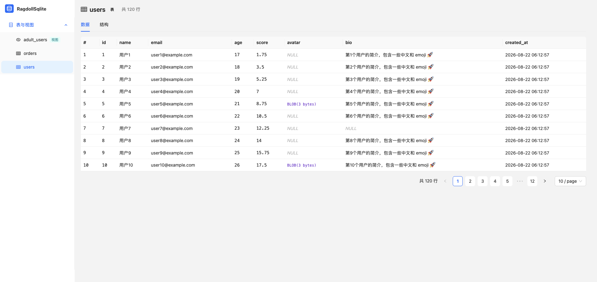

# RagdollSqlite

命令行工具：`ragdoll-sqlite [sqlite 路径]` 启动一个本地只读 Web 页面，在浏览器中浏览 SQLite 数据库的表、视图、结构与数据。数据库路径**可选**——不传也能启动，进入页面后在主页选择/切换数据库。



## 特性

- 🔒 **只读**：以 `readonly` 模式打开数据库，页面无任何写入口（应用数据存于独立 views.db）
- 📋 侧边栏「表与视图」+「自定义视图」菜单：可折叠、表/视图图标区分，菜单可自定义渲染与排序
- 🧱 表结构：字段（类型 / 主键 / 非空 / 默认值）、外键、索引
- 📄 分页浏览数据（默认 10 条/页，最大 50），NULL / BLOB / 中文 / emoji 安全展示；按列查询/过滤、排序、隐藏列
- 🔍 单元格 hover 弹 Popover 看完整内容（BLOB 含 hex 预览）；点击行弹出全字段详情
- 🏠 主页库总览：表/视图统计 + 表卡片直达 + 当前库路径展示
- 🔀 **多库切换**：启动时可省略数据库路径，主页选择/切换数据库（手动输入路径 / 最近打开列表，跨会话保留）
- ⌨️ **SQL 控制台**：CodeMirror 编辑器（高亮 + 表/列补全）、选中行执行、结果预览；SQL 草稿跨会话保留
- 📌 **自定义视图**：把查询保存为命名视图，左侧菜单直达，可编辑/删除（存 views.db）
- 🛡️ 只监听 `127.0.0.1` + 随机端口 + 随机 token 校验，防止本机其他进程探测
- 🖨️ 启动后只打印访问地址，需要自动打开浏览器时加 `--open`，Ctrl+C 优雅退出

## 安装与使用

已发布到 npm，全局安装后一条命令即可启动（数据库路径可选，不传则启动后在主页选择）：

```bash
# 全局安装（npm / pnpm 任选其一）
npm i -g ragdoll-sqlite
# 或：pnpm add -g ragdoll-sqlite

# 启动（--open 自动打开浏览器）
ragdoll-sqlite --open
```

从源码运行 / 开发：

```bash
pnpm install
pnpm build

# 本地运行（数据库路径可选，不传则启动后在主页选择）
node dist/cli.js ./path/to/database.db
node dist/cli.js                      # 不带路径，启动后主页选库

# 本地打包后全局安装
npm i -g .
ragdoll-sqlite ./path/to/database.db
```

启动后终端会打印访问地址（默认不自动打开浏览器；需要自动打开时加 `--open`），按 `Ctrl+C` 退出。

## 开发

```bash
pnpm typecheck      # 类型检查
pnpm lint           # ESLint（react-hooks 规则）
pnpm format         # Prettier 自动格式化
pnpm format:check   # 格式校验
pnpm test           # 服务端测试（node:test）+ 前端组件测试（vitest）
pnpm build          # 构建：tsc 编译 CLI/服务端 + vite 构建前端
pnpm dev:server     # 开发模式后端（固定端口 7860，跳过 token 校验）
pnpm dev:web        # vite dev server（5173，/api 代理到 7860），前端热更新
```

开发模式：先跑 `pnpm dev:server`，再跑 `pnpm dev:web`，浏览器打开 `http://127.0.0.1:5173/?t=dev`。指定要打开的数据库（可选，不指定则在主页选择）：

```bash
# 方式一：位置参数直接跟在命令后面（最简）
pnpm dev:server ./data/app.db

# 方式二：环境变量 RAGDOLL_DB（未传位置参数时生效）
RAGDOLL_DB=./data/app.db pnpm dev:server

# 方式三：不带路径启动，进入页面后在主页选择/切换数据库
pnpm dev:server
```

前端路径别名（仅前端使用，服务端保持相对导入；`vite.config.ts` 与 `tsconfig.json` 两处需保持一致）：

- `@/*` → `src/client/*`
- `@shared/*` → `src/shared/*`

## 技术栈

| 层     | 选型                                                                                                         |
| ------ | ------------------------------------------------------------------------------------------------------------ |
| 语言   | TypeScript（strict）                                                                                         |
| SQLite | `better-sqlite3`（只读模式）                                                                                 |
| 服务端 | Node 内置 `node:http`（静态托管 + REST API，无第三方框架）                                                   |
| 前端   | React 19 + antd v6 + Vite + react-router（HashRouter）+ CodeMirror 6（SQL 编辑器）（前后端分离 SPA，无 SSR） |
| 测试   | 服务端 Node 内置 `node:test` + 前端 vitest（happy-dom + Testing Library）                                    |
| 包管理 | pnpm                                                                                                         |

## 目录结构

```
├── package.json / pnpm-workspace.yaml
├── tsconfig.json / tsconfig.server.json / tsconfig.test.json
├── vite.config.ts / eslint.config.js / index.html
├── src/
│   ├── cli.ts              # 入口：参数解析、启动服务、打开浏览器、优雅退出
│   ├── server/
│   │   ├── http.ts         # node:http 服务器 + token 校验 + 静态托管 + 路由
│   │   ├── api.ts          # REST API 处理器
│   │   ├── db.ts           # better-sqlite3 只读封装（探活/元数据/分页/切换库/序列化/行数缓存）
│   │   └── views.ts        # 应用存储 views.db（自定义视图/草稿/最近打开）
│   ├── client/             # 前端 SPA（React 19 + antd v6 + react-router + CodeMirror）
│   │   ├── App.tsx          # 布局组装 + 全局加载态 + 路由表（由 NAV_ROUTES 生成）
│   │   ├── routes.tsx       # 顶层路由配置（单源：Routes 与 SiderMenu 共用，菜单可自定义渲染）
│   │   ├── context/         # 全局 Context：SchemasContext（表清单）/ ViewsContext（自定义视图）
│   │   ├── api.ts           # API 层：业务函数（fetch*/switchDatabase/runQuery 等）
│   │   ├── hooks/           # 数据获取 hooks：useTableData（详情/分页/序号守卫）
│   │   ├── components/      # 全局共享组件：SiderMenu / SqlEditor / QueryResultTable / CellValue
│   │   └── views/           # 页面视图（文件夹 + index.tsx，第一级只有页面，目录名 = 路由路径）
│   │       ├── home/        # 主页（库总览 + 当前数据库/切换）
│   │       ├── query/       # 查询（SQL 控制台：编辑器 + 结果预览 + 保存为视图）
│   │       └── table/       # 表数据页：?table= 表/视图、?viewId= 自定义视图
│   │           ├── index.css    # 页面专属样式
│   │           ├── CustomViewPanel.tsx  # 自定义视图页（SQL + 结果 + 编辑/删除）
│   │           └── TableView/   # 表浏览组件（私有）：index.tsx + components/ + columnUtils.ts
│   └── shared/             # 前后端共享：types.ts + constants.ts
└── test/                   # 服务端测试（db.test.ts / api.test.ts）+ 前端组件测试（client/，vitest）
```

## API

| 端点                                         | 说明                                                         |
| -------------------------------------------- | ------------------------------------------------------------ |
| `GET /api/tables`                            | 表/视图清单（表数 ≤50 时一次预取所有表头，更大库按需加载）   |
| `GET /api/databases`                         | 当前库信息（路径/大小/行数/每表行数）+ 最近打开列表          |
| `POST /api/databases/switch`                 | 切换数据库（body: `{path}`，只读打开新库）                   |
| `GET /api/tables/:name`                      | 表结构（字段/外键/索引/行数）                                |
| `GET /api/tables/:name/rows?page=&pageSize=` | 分页数据（可选 `filter` / `sortBy` / `sortDir` 参数）        |
| `POST /api/query`                            | 只读 SQL 查询（仅 SELECT/WITH/EXPLAIN/VALUES，上限 1000 行） |
| `POST /api/refresh`                          | 清空行数缓存（外部可能改过库）                               |
| `GET/POST /api/views`                        | 自定义视图：列表 / 新建（body: `{name, sql}`）               |
| `PUT/DELETE /api/views/:id`                  | 自定义视图：更新 / 删除                                      |
| `GET/PUT /api/draft`                         | SQL 编辑器草稿：读取 / 保存（跨会话保留）                    |

所有请求需携带访问令牌 `?t=<token>`（CLI 启动时生成，拼在页面 URL 中）。

自定义视图、SQL 草稿、最近打开等**应用数据**存于应用自己的 `~/.ragdoll-sqlite/views.db`（与被浏览的数据库完全隔离，用户库始终保持只读）；打开失败时相关功能降级不可用，不影响其他功能。

## Roadmap

已实现（详见 [docs/ROADMAP.md](docs/ROADMAP.md)）：刷新当前表、按列查询/过滤、列排序、路由化、主页库总览、SQL 控制台（只读查询）、自定义视图、多库切换。

规划中：导出 CSV / JSON、顶部历史页签栏、深色模式、大表虚拟滚动、翻页状态进 URL。
